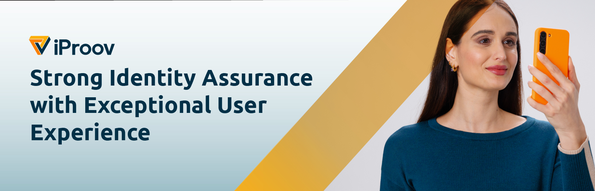

# iProov Biometrics iOS SDK v8.2.0

## Table of contents

- [Introduction](#introduction)
- [Repository contents](#repository-contents)
- [Upgrading from earlier versions](#upgrading-from-earlier-versions)
- [Registration](#registration)
- [Installation](#installation)
- [Get started](#get-started)
- [Options](#options)
- [Localization](#localization)
- [Handling failures & errors](#handling-failures--errors)
- [Sample code](#sample-code)
- [Help & support](#help--support)

## Introduction

The iProov Biometrics iOS SDK enables you to integrate iProov into your iOS app. We also have an [Android Biometrics SDK](https://github.com/iProov/android), [Xamarin bindings](https://github.com/iProov/xamarin) and [Web Biometrics SDK](https://github.com/iProov/web).

### Requirements

- iOS 9.0 and above
- Xcode 11.0 and above

The framework has been written in Swift 5.3, and we recommend use of Swift for the simplest and cleanest integration, however it is also possible to call iProov from within an Objective-C app using our [Objective-C API](https://github.com/iProov/ios/wiki/Objective-C-Support), which provides an Objective-C friendly API to invoke the Swift code.

### Dependencies

The iProov Biometrics SDK has a dependency on [Socket.IO-Client-Swift](https://github.com/socketio/socket.io-client-swift). This dependency will be automatically included if installing via Cocoapods.

The SDK also includes the following third-party code:

- A [forked version](https://github.com/iproovopensource/GPUImage2) of [GPUImage2](https://github.com/BradLarson/GPUImage2)
- [Expression](https://github.com/nicklockwood/Expression)
- [SwiftyJSON](https://github.com/SwiftyJSON/SwiftyJSON)
- [CryptoExportImportManager](https://github.com/DigitalLeaves/CryptoExportImportManager)

These dependencies are vendored and compiled into the SDK, this requires no action and is provided for information purposes only.

### Module Stability

Module stability is supported in Swift 5.1 (Xcode 11) and above. The advantage of this is that the SDK no longer needs to be recompiled for every new version of the Swift compiler.

iProov is built with the _"Build Libraries for Distribution"_ build setting enabled, which means that its dependencies must also be built in the same fashion. However, this is still not fully supported in either Cocoapods nor Carthage as of January 2021, therefore some workarounds are required (see installation documentation for details).

## Repository contents

The framework package is provided via this repository, which contains the following:

* **README.md** - This document!
* **WaterlooBank** - A sample project of iProov for the fictitious _"Waterloo Bank"_, written in Swift.
* **iProov.xcframework** - The iProov framework in XCFramework format. You can add this to your project manually if you aren't using a dependency manager.
* **iProov.framework** - The iProov framework as a "fat" dynamic framework for both device & simulator. (You can use this if you are unable to use the XCFramework version for whatever reason.)
* **iProov.podspec** - Required by Cocoapods. You do not need to do anything with this file.
* **resources** - Directory containing additional development resources you may find helpful.

## Upgrading from earlier versions

If you're already using an older version of the iProov Biometrics SDK, consult the [Upgrade Guide](https://github.com/iProov/ios/wiki/Upgrade-Guide) for detailed information about how to upgrade your app.

## Registration

You can obtain API credentials by registering on the [iProov Portal](https://portal.iproov.com/).

## Installation

Integration with your app is supported via Cocoapods and Carthage. We recommend Cocoapods for the easiest installation. (We do not currently support Swift Package Manager due to substantial limitations with how dependencies for binary targets are handled.)

### Cocoapods

The SDK is distributed as an XCFramework, therefore **you are required to use Cocoapods 1.9.0 or newer**.

1. If you are not yet using Cocoapods in your project, first run `sudo gem install cocoapods` followed by `pod init`. (For further information on installing Cocoapods, [click here](https://guides.cocoapods.org/using/getting-started.html#installation).)

2. Add the following to your Podfile (inside the target section):

	```ruby
	pod 'iProov'
	```
	
3. Add the following to the bottom of your Podfile:

	```ruby
	post_install do |installer|
	  installer.pods_project.targets.each do |target|
	    if ['iProov', 'Socket.IO-Client-Swift', 'Starscream'].include? target.name
	      target.build_configurations.each do |config|
	          config.build_settings['BUILD_LIBRARY_FOR_DISTRIBUTION'] = 'YES'
	      end
	    end
	  end
	end
	```

4. Run `pod install`.

5. Add an `NSCameraUsageDescription` entry to your app's Info.plist, with the reason why your app requires camera access (e.g. “To iProov you in order to verify your identity.”)

### Carthage

Cocoapods is recommend for the easiest integration, however we also support Carthage. Full instructions installing and setting up Carthage [are available here](https://github.com/Carthage/Carthage).

You have a choice of two different methods to install iProov using Carthage, depending on your requirements. If you are unsure which to choose, then for most people choosing the XCFrameworks approach is likely to be the simplest and most appropriate.

<details>
	<summary>Use XCFrameworks (for Carthage 0.37.0 and newer)</summary>
	
Carthage 0.37.0 now supports building XCFrameworks. Unfortunately, however, pre-built binary XCFrameworks such as iProov [are still not supported properly](https://github.com/Carthage/Carthage/issues/3103).

Therefore, this guide will then explain how to build Socket.IO (and its dependency, Starscream) as XCFrameworks using Carthage, and then you will need to copy the pre-built iProov.xcframework into your project.

1. Add the following to your Cartfile:

	```
	github "socketio/socket.io-client-swift" == 15.2.0
	```

2. You can now build Socket.IO (and by extension, Starscream) with Carthage as XCFrameworks:

	```sh
	echo 'BUILD_LIBRARY_FOR_DISTRIBUTION=YES'>/tmp/config.xcconfig; XCODE_XCCONFIG_FILE=/tmp/config.xcconfig carthage update --use-xcframeworks --platform ios; rm /tmp/config.xcconfig
	```
	
	> NOTE: You must use this exact build command rather than a normal `carthage update`. It will set `BUILD_LIBRARIES_FOR_DISTRIBUTION` to ensure that iProov's dependencies are built for distribution, build XCFrameworks instead of standard fat frameworks (`--use-xcframeworks`) and avoid a linking issue with SocketIO if you attempt to build for platforms other than iOS (`--platform ios`).
	
3. From the Carthage/Build folder, add SocketIO.xcframework & Starscream.xcframework to your app's *"Frameworks, Libraries, and Embedded Content"* section.

4. From this repository, copy iProov.xcframework to your app's *"Frameworks, Libraries, and Embedded Content"* section.

5. Add an `NSCameraUsageDescription` entry to your app's Info.plist, with the reason why your app requires camera access (e.g. "To iProov you in order to verify your identity.")

</details>

<details>
	<summary>Use universal frameworks (for all Carthage versions)</summary>
	
If you are using Carthage 0.36.0 or earlier, or you wish to remain using traditional universal (fat) frameworks, you can follow these steps to install iProov and its dependencies as universal frameworks using Carthage.

1. Add the following to your Cartfile:

	```
	binary "https://raw.githubusercontent.com/iProov/ios/master/carthage/IProov.json"
	github "socketio/socket.io-client-swift" == 15.2.0
	```
	
2. Create the following workaround script in your root Carthage directory:

	```sh
	# carthage.sh
	# Usage example: ./carthage.sh build --platform iOS
	
	set -euo pipefail
	
	xcconfig=$(mktemp /tmp/static.xcconfig.XXXXXX)
	trap 'rm -f "$xcconfig"' INT TERM HUP EXIT
	
	# For Xcode 12 make sure EXCLUDED_ARCHS is set to arm architectures otherwise
	# the build will fail on lipo due to duplicate architectures.
	
	CURRENT_XCODE_VERSION=$(xcodebuild -version | grep "Build version" | cut -d' ' -f3)
	echo "EXCLUDED_ARCHS__EFFECTIVE_PLATFORM_SUFFIX_simulator__NATIVE_ARCH_64_BIT_x86_64__XCODE_1200__BUILD_$CURRENT_XCODE_VERSION = arm64 arm64e armv7 armv7s armv6 armv8" >> $xcconfig
	
	echo 'EXCLUDED_ARCHS__EFFECTIVE_PLATFORM_SUFFIX_simulator__NATIVE_ARCH_64_BIT_x86_64__XCODE_1200 = $(EXCLUDED_ARCHS__EFFECTIVE_PLATFORM_SUFFIX_simulator__NATIVE_ARCH_64_BIT_x86_64__XCODE_1200__BUILD_$(XCODE_PRODUCT_BUILD_VERSION))' >> $xcconfig
	echo 'EXCLUDED_ARCHS = $(inherited) $(EXCLUDED_ARCHS__EFFECTIVE_PLATFORM_SUFFIX_$(EFFECTIVE_PLATFORM_SUFFIX)__NATIVE_ARCH_64_BIT_$(NATIVE_ARCH_64_BIT)__XCODE_$(XCODE_VERSION_MAJOR))' >> $xcconfig
	
	# Enable BUILD_LIBRARY_FOR_DISTRIBUTION for all frameworks.
	
	echo 'BUILD_LIBRARY_FOR_DISTRIBUTION=YES' >> $xcconfig
	
	export XCODE_XCCONFIG_FILE="$xcconfig"
	carthage "$@"
	```
	
	This script contains two workarounds:
	
	1. Universal frameworks cannot support multiple copies of the same architecture. This workaround prevents Xcode 12 for building for the arm64 simulator (Apple Silicon) which will cause `lipo` to fail to produce the fat universal framework. This is taken from [the official Carthage Xcode 12 workaround](https://github.com/Carthage/Carthage/blob/master/Documentation/Xcode12Workaround.md).
	2. It enables `BUILD_LIBRARY_FOR_DISTRIBUTION` so that iProov's dependencies are built with this option enabled.

3. Make the script executable:

	```sh
	chmod +x carthage.sh
	```

4. You can now build all the dependencies as follows:

	```sh
	./carthage.sh update
	```
	
	> NOTE: Ensure you use `./carthage.sh` instead of `carthage`. All command usages remain the same.

5. Follow the [normal steps](https://github.com/Carthage/Carthage#if-youre-building-for-ios-tvos-or-watchos) to add the frameworks built by Carthage to your project. You need to add iProov.framework, SocketIO.framework & Starscream.framework.

6. Add an `NSCameraUsageDescription` entry to your app's Info.plist, with the reason why your app requires camera access (e.g. "To iProov you in order to verify your identity.")
</details>

## Get started

### Get a token

Before being able to launch iProov, you need to get a token to iProov against. There are 2 different token types:

* A **verify** token - for logging-in an existing user
* An **enrol** token - for registering a new user

In addition, the Biometrics SDK now supports two difference assurance types:

* [**Genuine Presence Assurance**](https://www.iproov.com/iproov-system/technology/genuine-presence-assurance) - iProov's flagship technology, Genuine Presence Assurance delivers the highest security for online authentication and is the only way to check that an online user is the right person, a real person, and that they are authenticating right now.
* [**Liveness Assurance**](https://www.iproov.com/iproov-system/technology/liveness-assurance) - Delivering all of the benefits that you will find in other liveness detection solutions, Liveness Assurance provides a simple, passive user experience and can form a unique, integrated package with iProov Genuine Presence Assurance technology to give you extra security when you need it.

Please consult our [REST API documentation](https://secure.iproov.me/docs.html) for details on how to generate tokens.

> **💡 TIP:** In a production app, you should always obtain tokens securely via a server-to-server call. To save you having to setup a server for demo/PoC apps for testing, we provide Swift sample code for obtaining tokens via [iProov API v2](https://secure.iproov.me/docs.html) with our open-source [iOS API Client](https://github.com/iProov/ios-api-client). You should ensure you migrate to server-to-server calls before going into production, and don't forget to reset your API key & secret!

### Launch the SDK

Once you have obtained a token, you can simply call `IProov.launch()`:

```swift
let streamingURL = "https://eu.rp.secure.iproov.me" // Substitute as appropriate
let token = "{{ your token here }}"

IProov.launch(streamingURL: streamingURL, token: token) { status in

    switch status {
    case .connecting:
        // The SDK is connecting to the server. You should provide an indeterminate progress indicator
        // to let the user know that the connection is taking place.

    case .connected:
        // The SDK has connected, and the iProov user interface will now be displayed. You should hide
        // any progress indication at this point.

    case let .processing(progress, message):
        // The scan has completed, and the SDK will update your app with the progress of streaming
        // to the server and authenticating the user.
        // This will be called multiple times as the progress updates.

    case let .success(result):
        // The user was successfully verified/enrolled and the token has been validated.
        // You can access the following properties:
        let token: String = result.token // The token passed back will be the same as the one passed in to the original call
        let frame: UIImage? = result.frame // An optional image containing a single frame of the user, if enabled for your service provider (see important security info below)

    case let .failure(result):
        // The user was not successfully verified/enrolled, as their identity could not be verified,
        // or there was another issue with their verification/enrollment.
        // You can access the following properties:
        let token: String = result.token // The token passed back will be the same as the one passed in to the original call
        let reason: String = result.reason // A human-readable reason of why the claim failed
        let feedbackCode: String = result.feedbackCode // A code referring to the failure reason (see list below)
        let frame: UIImage? = result.frame // An optional image containing a single frame of the user, if enabled for your service provider (see important security info below)

    case .cancelled:
        // The user cancelled iProov, either by pressing the close button at the top right, or sending
        // the app to the background.

    case let .error(error):
        // The user was not successfully verified/enrolled due to an error (e.g. lost internet connection)
        // along with an `iProovError` with more information about the error (NSError in Objective-C).
        // It will be called once, or never.

        @unknown default:
        // Reserved for future usage.
        break
    }
}
```

> **⚠️ SECURITY NOTICE:** You should never use iProov as a local authentication method. This means that:
> 
> * You cannot rely on the fact that the success result was returned to prove that the user was authenticated or enrolled successfully (it is possible the iProov process could be manipulated locally by a malicious user). You can treat the success callback as a hint to your app to update the UI, etc. but you must always independently validate the token server-side (using the `/validate` API call) before performing any authenticated user actions.
> 
> * The `frame` returned in the success & failure results should be used for UI/UX purposes only. If you require an image for upload into your system for any reason (e.g. face matching, image analysis, user profile image, etc.) you should retrieve this securely via the server-to-server [`/validate`](https://secure.iproov.me/docs.html#operation/userVerifyValidate) API call.

## Options

You can customize the iProov session by passing in an `Options` object when launching iProov and setting any of these variables:

```swift
let options = Options()

/*
	UIOptions
	Configure options relating to the user interface
*/

options.ui.filter = .shaded // Adjust the filter used for the face preview. Can be .classic (as in pre-v7), .shaded (additional detail, the default in v7) or .vibrant (full color).

// Adjust various colors for the camera preview:
options.ui.lineColor = .white
options.ui.backgroundColor = .black
options.ui.loadingTintColor = .lightGray
options.ui.notReadyTintColor = .orange
options.ui.readyTintColor = .green
options.ui.livenessTintColor = .blue

options.ui.title = "Authenticating to ACME Bank" // Specify a custom title to be shown. Defaults to nil which will show an iProov-generated message. Set to empty string ("") to hide the message entirely.
options.ui.font = "SomeFont" // You can specify your own font. This can either be a system font or a custom font in your app bundle (in which case don't forget to also add the font file to your Info.plist).
options.ui.logoImage = UIImage(named: "AcmeLogo") // A custom logo to be shown at the top-right of the iProov screen.
options.ui.scanLineDisabled = false // Disables the vertical sweeping scanline whilst flashing.
options.ui.autoStartDisabled = false // Disable the "auto start" countdown functionality. The user will have to tap the screen to start iProoving.
options.ui.presentationDelegate = MyPresentationDelegate() // See the section below entitled "Custom IProovPresentationDelegate".
options.ui.stringsBundle = Bundle(for: Foo.class) // Pass a custom bundle for string localization (see Localization Guide for further information).
options.ui.stringsTable = "Localizable-MyApp.strings" // Pass a custom strings filename (table name) for string localization.

/*
	NetworkOptions
	Configure options relating to networking & security
*/

options.network.certificates = [Bundle.main.path(forResource: "custom_cert", ofType: "der")!] // Supply an array of paths of certificates to be used for pinning. Useful when using your own proxy server, or for overriding the built-in certificate pinning for some other reason. Certificates should be generated in DER-encoded X.509 certificate format, eg. with the command: $ openssl x509 -in cert.crt -outform der -out cert.der
options.network.certificatePinningDisabled = false	// Disables SSL/TLS certificate pinning to the server. WARNING! Do not enable this in production apps.
options.network.timeout = 10 // The network timeout in seconds.
options.network.path = "/socket.io/v2/" // The path to use when streaming, defaults to /socket.io/v2/. You should not need to change this unless directed to do so by iProov.

/*
	CaptureOptions
	Configure options relating to the capture functionality
*/

// You can specify max yaw/roll/pitch deviation of the user's face to ensure a given pose. Values are provided in normalised units.
// These options should not be set for general use. Please contact iProov for further information if you would like to use this feature.

options.capture.maxYaw = 0.03
options.capture.maxRoll = 0.03
options.capture.maxPitch = 0.03

```

### Custom `IProovPresentationDelegate`

By default, upon launching the SDK, it will get a reference to your app delegate's window's `rootViewController`, then iterate through the view controller stack to find the top-most view controller and then `present()` iProov's view controller as a modal view controller from the top-most view controller on the stack.

This may not always be the desirable behaviour; for instance, you may wish to present iProov as part of a `UINavigationController`-based flow. Therefore, it is also possible to set the `options.ui.presentationDelegate` property, which allows you to override the presentation/dismissal behaviour of the iProov view controller by conforming to the `IProovPresentationDelegate` protocol:

```swift
extension MyViewController: IProovPresentationDelegate {

    func present(iProovViewController: UIViewController) {
        // How should we present the iProov view controller?
    }

    func dismiss(iProovViewController: UIViewController) {
        // How should we dismiss the iProov view controller once it's done?
    }

}
```

> ⚠️ **IMPORTANT:** There are a couple of important rules you **must** follow when using this functionality:
> 
> 1. With great power comes great responsibility! The iProov view controller requires full cover of the entire screen in order to work properly. Do not attempt to present your view controller to the user in such a way that it only occupies part of the screen, or is obscured by other views. Also, you must ensure that the view controller is entirely removed from the user's view once dismissed.
> 
> 2. To avoid the risk of retain cycles, `Options` only holds a **weak** reference to your presentation delegate. Ensure that your presentation delegate is retained for the lifetime of the iProov capture session, or you may result in a defective flow.

## Localization

The SDK ships with English strings only. If you wish to customise the strings in the app or localize them into a different language, see our [Localization Guide](https://github.com/iProov/ios/wiki/Localization).

## Handling failures & errors

### Failures

Failures occur when the user's identity could not be verified for some reason. A failure means that the capture was successfully received and processed by the server, which returned a result. Crucially, this differs from an error, where the capture itself failed due to a system failure.

Failures are caught via the `.failure(reason, feedbackCode)` enum case in the callback:

- `reason` - The reason that the user could not be verified/enrolled. You should present this to the user as it may provide an informative hint for the user to increase their chances of iProoving successfully next time

- `feedbackCode` - An internal representation of the failure code.

The current feedback codes and reasons are as follows:

| `feedbackCode` | `reason` |
|-----------------------------------|---------------------------------------------------------------|
| `ambiguous_outcome` | Sorry, ambiguous outcome |
| `motion_too_much_movement` | Please do not move while iProoving |
| `lighting_flash_reflection_too_low` | Ambient light too strong or screen brightness too low |
| `lighting_backlit` | Strong light source detected behind you |
| `lighting_too_dark` | Your environment appears too dark |
| `lighting_face_too_bright` | Too much light detected on your face |
| `motion_too_much_mouth_movement` | Please do not talk while iProoving |

The list of feedback codes and reasons is subject to change.

### Errors

Errors occur when the capture could not be completed due to a technical problem or user action which prevents the capture from completing.

Errors are caught via the `.error(error)` enum case in the callback. The `error` parameter provides the reason the iProov process failed as an `IProovError`.

A description of these cases are as follows:

* `captureAlreadyActive` - An existing iProov capture is already in progress. Wait until the current capture completes before starting a new one.
* `networkError(String?)` - An error occurred with the video streaming process. Consult the error associated value for more information.
* `encoderError(code: Int32?)` - An error occurred with the video encoder. Report the error code to iProov for further assistance.
* `lightingModelError` - An error occurred with the lighting mode. This should be reported to iProov for further assistance.
* `cameraError(String?)` - An error occurred with the camera.
* `cameraPermissionDenied` - The user disallowed access to the camera when prompted. You should direct the user to re-enable camera access via Settings.
* `serverError(String?)` - A server-side error/token invalidation occurred. The associated string will contain further information about the error.

## Sample code

For a simple iProov experience that is ready to run out-of-the-box, check out the [Waterloo Bank sample project](https://github.com/iProov/ios/tree/master/WaterlooBank).

### Installation

1. Ensure that you have [Cocoapods installed](https://guides.cocoapods.org/using/getting-started.html#installation) and then run `pod install` from the WaterlooBank directory to install the required dependencies.

2. Open `WaterlooBank.xcworkspace` then navigate to `HomeViewController.swift` and add your API key and Secret at the appropriate point.

3. You can now build and run the project. Please note that you can only launch iProov on a real device; it will not work in the simulator.

> **⚠️ SECURITY NOTICE:** The Waterloo Bank sample project uses the [iOS API Client](https://github.com/iProov/ios-api-client) to directly fetch tokens on-device and this is inherently insecure. Production implementations of iProov should always obtain tokens securely from a server-to-server call.

## Help & support

You may find your question is answered in our [FAQs](https://github.com/iProov/ios/wiki/Frequently-Asked-Questions) or one of our other [Wiki pages](https://github.com/iProov/ios/wiki).

For further help with integrating the iProov Biometrics SDK, please contact [support@iproov.com](mailto:support@iproov.com).
